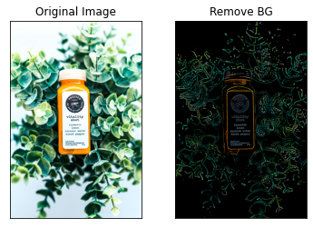

# Semantic Image Segmentation - Remove background of Images

## Abstract

- __Objective__ : Modern Computer Vision technology, based on AI and deep learning methods, has evolved dramatically in the past decade. Today it is used for applications like image classification, face recognition, identifying objects, video analysis and classification. Hence, people harness the incredible power of such deep learning application as image segmentation to handily tackle various works like make their products' background become transparent, therefore, make them more appeal and elegant to the customers.

- __Method__ : From the my perspective, I have applied multiple methods from ordinary means of digital image processing to advance ways of using deep neural networks.

- __Result__ : The open dataset of animal, *[oxford_iiit_pet](https://www.tensorflow.org/datasets/catalog/oxford_iiit_pet)*, is used for the training of the U-net models. Additionally, I make the advance of multiple pretrained model such as *[MobileNetV2](https://www.tensorflow.org/api_docs/python/tf/keras/applications/MobileNetV2)*, *[MobileNetV3Large](https://www.tensorflow.org/api_docs/python/tf/keras/applications/MobileNetV3Large)* to enhance the precision of models which are 87% and 78% respectively.

## I. Introduction

According to what a can see on such eCommerce website like Amazon, Shopee and Tiki, It is a must that the background of products' image is either transparented or white.


Indeed, it is one of the most important factors which decide that these websites will accepted your product image to be displyed or not in their store. It lead to the fact that I could make the most of cutting edge technology like segmentic image segmentation and digital iamge processing to achieve the things that all retailers desire - Their product image will have an elegant white or transparent background.

## II. Old-school methods - Digital Image Processing

### 1. Image thresholding

> Thresholding—divides an image into a foreground and background. A specified threshold value separates pixels into one of two levels to isolate objects. Thresholding converts grayscale images into binary images or distinguishes the lighter and darker pixels of a color image.

#### i. Simple Threshold

##### Definition

> For every pixel, the same threshold value is applied. If the pixel value is smaller than the threshold, it is set to 0, otherwise it is set to a maximum value. The function cv.threshold is used to apply the thresholding. The first argument is the source image, which should be a grayscale image. The second argument is the threshold value which is used to classify the pixel values. The third argument is the maximum value which is assigned to pixel values exceeding the threshold. OpenCV provides different types of thresholding which is given by the fourth parameter of the function. Basic thresholding as described above is done by using the type cv.THRESH_BINARY. All simple thresholding types are:

 - cv.THRESH_BINARY
 - cv.THRESH_BINARY_INV
 - cv.THRESH_TRUNC
 - cv.THRESH_TOZERO
 - cv.THRESH_TOZERO_INV

##### Experiment 


```python
from lib import GlobalThreshold as GThresh

# Init the preprocessor
kernel_size = (13, 13)
preprocessor = Blur(kernel_size)

# Init stragegy for remove background
stragegy = GThresh(
    min = 127, 
    max = 255, 
    mode = cv.THRESH_BINARY_INV,
    preprocessor = preprocessor    
)

# Start app
app = App(stragegy)

# Show results
for i in range(1, 8):
    app.show_img_after_remove_bg(IMG_DIR + 'img' + str(i) + '.jpg')
```


#### ii. Adaptive Threshold

##### Definition

> In the previous section, we used one global value as a threshold. But this might not be good in all cases, e.g. if an image has different lighting conditions in different areas. In that case, adaptive thresholding can help. Here, the algorithm determines the threshold for a pixel based on a small region around it. So we get different thresholds for different regions of the same image which gives better results for images with varying illumination.
 - cv.ADAPTIVE_THRESH_MEAN_C: The threshold value is the mean of the    neighbourhood area minus the constant C.
 - cv.ADAPTIVE_THRESH_GAUSSIAN_C: The threshold value is a gaussian-weighted sum of the neighbourhood values minus the constant C.
The blockSize determines the size of the neighbourhood area and C is a constant that is subtracted from the mean or weighted sum of the neighbourhood pixels.

##### Experiment


```python
from lib import AdaptiveThreshold as AThresh

# Init the preprocessor
kernel_size = (13, 13)
preprocessor = Blur(kernel_size)

# Init stragegy for remove background
stragegy = AThresh(
    max = 255, 
    mode = cv.THRESH_BINARY_INV,
    adaptive = cv.ADAPTIVE_THRESH_GAUSSIAN_C,
    C = 2,
    blocksize = 11,
    preprocessor = preprocessor    
)

# Set app's stragegy
app.set_stragegy(stragegy)

# Show results
for i in range(1, 8):
    app.show_img_after_remove_bg(IMG_DIR + 'img' + str(i) + '.jpg')
```





### 2. Clustering 

> Clustering - algorithms identify groups in the data, with the variable K representing the number of groups. The algorithm assigns each data point (or pixel) to one of the groups based on feature similarity. Rather than analyzing predefined groups, clustering works iteratively to organically form groups.

#### i. K-Mean Clustering

##### Definition

This algorithm is an iterative process. We will explain it step-by-step with the help of images.

Consider a set of data as below ( You can consider it as t-shirt problem). We need to cluster this data into two groups.

Step : 1 - Algorithm randomly chooses two centroids, C1 and C2 (sometimes, any two data are taken as the centroids).

Step : 2 - It calculates the distance from each point to both centroids. If a test data is more closer to C1, then that data is labelled with '0'. If it is closer to C2, then labelled as '1' (If more centroids are there, labelled as '2','3' etc).

In our case, we will color all '0' labelled with red, and '1' labelled with blue. So we get following image after above operations.

Step : 3 - Next we calculate the average of all blue points and red points separately and that will be our new centroids. That is C1 and C2 shift to newly calculated centroids. (Remember, the images shown are not true values and not to true scale, it is just for demonstration only).

And again, perform step 2 with new centroids and label data to '0' and '1'.

So we get result as below :

So this is just an intuitive understanding of K-Means Clustering. For more details and mathematical explanation, please read any standard machine learning textbooks or check links in additional resources. It is just a top layer of K-Means clustering. There are a lot of modifications to this algorithm like, how to choose the initial centroids, how to speed up the iteration process etc.

##### Experiment


```python
from lib import KMeamClustering as KMean

# Init the preprocessor
kernel_size = (13, 13)
preprocessor = Blur(kernel_size)

# Init stragegy for remove background
stragegy = KMean(
    numberOfClusters = 2
)

# Set app's stragegy
app.set_stragegy(stragegy)

# Show results
for i in range(1, 8):
    app.show_img_after_remove_bg(IMG_DIR + 'img' + str(i) + '.jpg')
```


#### ii. Mean Shift Clustering

##### Definition

> Mean shift clustering using a flat kernel.
Mean shift clustering aims to discover “blobs” in a smooth density of samples. It is a centroid-based algorithm, which works by updating candidates for centroids to be the mean of the points within a given region. These candidates are then filtered in a post-processing stage to eliminate near-duplicates to form the final set of centroids.
Seeding is performed using a binning technique for scalability.

##### Experiment


```python
from lib import Mean_Shift
from lib import RemoveBG as App

# Init stragegy for remove background
stragegy = Mean_Shift()

# Set app's stragegy
app = App(stragegy)
app.set_stragegy(stragegy)

# Show results
    for i in range(1, 8):
        app.show_img_after_remove_bg(IMG_DIR + 'img' + str(i) + '.jpg')
```


## III. Image Segmentation with U-Net Models (Three Models)

### 1. Display dataset images


### 2. Brief information of Models 

#### a. U-net MobileNetV2 Model

The architecture of model is taking the advantage of MobileNetV2 pretrained model with imagenet weight 

The reason why I choose this type of pretrained model is :
- It is lighter than such models as VGG, Inception or ResNet 
- it has many features that suitable for being the encoder of my model
***
In compile stage, I apply:
- Optimizer: Apdaptive Momemtum Estimation (ADAM) 
    - Hyperparameter : B1 = 0.9, B2= 0.999
    - Exponential Decay Learning Rate : 
        - Initial learning rate : 0.1
        - Decay learning rate : one time per 100000 steps
        - Decay base : 0.95
        - Apply staircase mode
- Loss function : Categorical Crossentropy
    - Logits mode applied
- Number of epoch : 50 epochs
***
In training stage, I apply :
- Callbacks:
    - Early Stopping on trainng loss with patience is 5
    - Early Stopping on validation loss with patience is 5

***

```
Model: "U-net MobileNetV2"
__________________________________________________________________________________________________
Layer (type)                    Output Shape         Param #     Connected to                     
==================================================================================================
input_2 (InputLayer)            [(None, 224, 224, 3) 0                                            
__________________________________________________________________________________________________
model (Functional)              [(None, 112, 112, 96 1522304     input_2[0][0]                    
__________________________________________________________________________________________________
sequential (Sequential)         (None, 14, 14, 1024) 8851456     model[0][4]                      
__________________________________________________________________________________________________
concatenate (Concatenate)       (None, 14, 14, 1600) 0           sequential[0][0]                 
                                                                    model[0][3]                      
__________________________________________________________________________________________________
sequential_1 (Sequential)       (None, 28, 28, 512)  7374848     concatenate[0][0]                
__________________________________________________________________________________________________
concatenate_1 (Concatenate)     (None, 28, 28, 704)  0           sequential_1[0][0]               
                                                                    model[0][2]                      
__________________________________________________________________________________________________
sequential_2 (Sequential)       (None, 56, 56, 256)  1623040     concatenate_1[0][0]              
__________________________________________________________________________________________________
concatenate_2 (Concatenate)     (None, 56, 56, 400)  0           sequential_2[0][0]               
                                                                    model[0][1]                      
__________________________________________________________________________________________________
sequential_3 (Sequential)       (None, 112, 112, 128 461312      concatenate_2[0][0]              
__________________________________________________________________________________________________
concatenate_3 (Concatenate)     (None, 112, 112, 224 0           sequential_3[0][0]               
                                                                    model[0][0]                      
__________________________________________________________________________________________________
conv2d_transpose_4 (Conv2DTrans (None, 224, 224, 3)  6051        concatenate_3[0][0]              
==================================================================================================
Total params: 19,839,011
Trainable params: 18,312,867
Non-trainable params: 1,526,144
__________________________________________________________________________________________________
```


```
Training Process
Epoch 1/50
28/28 [==============================] - 61s 2s/step - loss: 4.0434 - accuracy: 0.4565 - val_loss: 16.5655 - val_accuracy: 0.5628
Epoch 2/50
28/28 [==============================] - 48s 2s/step - loss: 1.0608 - accuracy: 0.5953 - val_loss: 1.5554 - val_accuracy: 0.6071
Epoch 3/50
28/28 [==============================] - 46s 2s/step - loss: 0.4784 - accuracy: 0.8213 - val_loss: 4.1752 - val_accuracy: 0.6070
Epoch 4/50
28/28 [==============================] - 49s 2s/step - loss: 0.3256 - accuracy: 0.8676 - val_loss: 3.3945 - val_accuracy: 0.6113
Epoch 5/50
28/28 [==============================] - 49s 2s/step - loss: 0.2898 - accuracy: 0.8803 - val_loss: 1.9399 - val_accuracy: 0.6423
Epoch 6/50
28/28 [==============================] - 49s 2s/step - loss: 0.2631 - accuracy: 0.8908 - val_loss: 1.4994 - val_accuracy: 0.6549
Epoch 7/50
28/28 [==============================] - 49s 2s/step - loss: 0.2570 - accuracy: 0.8933 - val_loss: 0.6933 - val_accuracy: 0.7707
Epoch 8/50
28/28 [==============================] - 49s 2s/step - loss: 0.2491 - accuracy: 0.8964 - val_loss: 0.4914 - val_accuracy: 0.8232
Epoch 9/50
28/28 [==============================] - 50s 2s/step - loss: 0.2372 - accuracy: 0.9004 - val_loss: 0.4374 - val_accuracy: 0.8355
Epoch 10/50
28/28 [==============================] - 50s 2s/step - loss: 0.2364 - accuracy: 0.9008 - val_loss: 0.3297 - val_accuracy: 0.8677
Epoch 11/50
28/28 [==============================] - 50s 2s/step - loss: 0.2391 - accuracy: 0.8996 - val_loss: 0.2910 - val_accuracy: 0.8820
Epoch 12/50
28/28 [==============================] - 49s 2s/step - loss: 0.2279 - accuracy: 0.9036 - val_loss: 0.2691 - val_accuracy: 0.8902
Epoch 13/50
28/28 [==============================] - 49s 2s/step - loss: 0.2216 - accuracy: 0.9056 - val_loss: 0.2585 - val_accuracy: 0.8959
Epoch 14/50
28/28 [==============================] - 50s 2s/step - loss: 0.2168 - accuracy: 0.9072 - val_loss: 0.2517 - val_accuracy: 0.8996
Epoch 15/50
28/28 [==============================] - 50s 2s/step - loss: 0.2172 - accuracy: 0.9076 - val_loss: 0.2509 - val_accuracy: 0.8994
Epoch 16/50
28/28 [==============================] - 50s 2s/step - loss: 0.2092 - accuracy: 0.9101 - val_loss: 0.2558 - val_accuracy: 0.8980
Epoch 17/50
28/28 [==============================] - 50s 2s/step - loss: 0.2053 - accuracy: 0.9116 - val_loss: 0.2681 - val_accuracy: 0.8958
Epoch 18/50
28/28 [==============================] - 50s 2s/step - loss: 0.2089 - accuracy: 0.9105 - val_loss: 0.2569 - val_accuracy: 0.9003
Epoch 19/50
28/28 [==============================] - 50s 2s/step - loss: 0.1971 - accuracy: 0.9144 - val_loss: 0.2590 - val_accuracy: 0.9002
Epoch 20/50
28/28 [==============================] - 49s 2s/step - loss: 0.1942 - accuracy: 0.9155 - val_loss: 0.2718 - val_accuracy: 0.8968
```


```
Final result on test set :
29/29 [==============================] - 23s 790ms/step - loss: 0.2690 - accuracy: 0.8971
```

#### b. U-net MobileNetV3 Model

The architecture of model is taking the advantage of MobileNetV3Large pretrained model with imagenet weight 

The reason why I choose this type of pretrained model is :
- It is lighter than such models as VGG, Inception or ResNet 
- it has many features that suitable for being the encoder of my model
- Trsusting it do better job than its ancestor MobileNetV2
***
In compile stage, I apply:
- Optimizer: Apdaptive Momemtum Estimation (ADAM) 
    - Hyperparameter : B1 = 0.9, B2= 0.999
    - Exponential Decay Learning Rate : 
        - Initial learning rate : 0.03
        - Decay learning rate : one time per 100000 steps
        - Decay base : 0.95
        - Apply staircase mode
- Loss function : Categorical Crossentropy
    - Logits mode applied
- Number of epoch : 50 epochs
***
In training stage, I apply :
- Callbacks:
    - Early Stopping on trainng loss with patience is 5
    - Early Stopping on validation loss with patience is 5

***


```
Model: "U-net MobileNetV3 Model"
__________________________________________________________________________________________________
Layer (type)                    Output Shape         Param #     Connected to                     
==================================================================================================
input_4 (InputLayer)            [(None, 224, 224, 3) 0                                            
__________________________________________________________________________________________________
model_2 (Functional)            [(None, 112, 112, 64 4226432     input_4[0][0]                    
__________________________________________________________________________________________________
sequential_4 (Sequential)       (None, 14, 14, 1024) 11800576    model_2[0][4]                    
__________________________________________________________________________________________________
concatenate_4 (Concatenate)     (None, 14, 14, 1696) 0           sequential_4[0][0]               
                                                                    model_2[0][3]                    
__________________________________________________________________________________________________
sequential_5 (Sequential)       (None, 28, 28, 512)  7817216     concatenate_4[0][0]              
__________________________________________________________________________________________________
concatenate_5 (Concatenate)     (None, 28, 28, 752)  0           sequential_5[0][0]               
                                                                    model_2[0][2]                    
__________________________________________________________________________________________________
sequential_6 (Sequential)       (None, 56, 56, 256)  1733632     concatenate_5[0][0]              
__________________________________________________________________________________________________
concatenate_6 (Concatenate)     (None, 56, 56, 328)  0           sequential_6[0][0]               
                                                                    model_2[0][1]                    
__________________________________________________________________________________________________
sequential_7 (Sequential)       (None, 112, 112, 128 378368      concatenate_6[0][0]              
__________________________________________________________________________________________________
concatenate_7 (Concatenate)     (None, 112, 112, 192 0           sequential_7[0][0]               
                                                                    model_2[0][0]                    
__________________________________________________________________________________________________
conv2d_transpose_9 (Conv2DTrans (None, 224, 224, 3)  5187        concatenate_7[0][0]              
==================================================================================================
Total params: 25,961,411
Trainable params: 21,731,139
Non-trainable params: 4,230,272
__________________________________________________________________________________________________
```


```
Training Process:
Epoch 1/50
28/28 [==============================] - 63s 2s/step - loss: 3.0286 - accuracy: 0.4597 - val_loss: 2.0187 - val_accuracy: 0.3537
Epoch 2/50
28/28 [==============================] - 48s 2s/step - loss: 1.0852 - accuracy: 0.5193 - val_loss: 0.9802 - val_accuracy: 0.5178
Epoch 3/50
28/28 [==============================] - 45s 2s/step - loss: 0.8986 - accuracy: 0.5861 - val_loss: 0.9585 - val_accuracy: 0.4705
Epoch 4/50
28/28 [==============================] - 46s 2s/step - loss: 0.8137 - accuracy: 0.6326 - val_loss: 1.5124 - val_accuracy: 0.4686
Epoch 5/50
28/28 [==============================] - 46s 2s/step - loss: 0.7515 - accuracy: 0.6864 - val_loss: 0.9496 - val_accuracy: 0.5947
Epoch 6/50
28/28 [==============================] - 47s 2s/step - loss: 0.7487 - accuracy: 0.6887 - val_loss: 0.8495 - val_accuracy: 0.6332
Epoch 7/50
28/28 [==============================] - 47s 2s/step - loss: 0.7539 - accuracy: 0.6864 - val_loss: 0.7806 - val_accuracy: 0.6716
Epoch 8/50
28/28 [==============================] - 48s 2s/step - loss: 0.7403 - accuracy: 0.6927 - val_loss: 0.7855 - val_accuracy: 0.6723
Epoch 9/50
28/28 [==============================] - 48s 2s/step - loss: 0.7326 - accuracy: 0.6966 - val_loss: 0.8247 - val_accuracy: 0.6455
Epoch 10/50
28/28 [==============================] - 48s 2s/step - loss: 0.7419 - accuracy: 0.6928 - val_loss: 0.7667 - val_accuracy: 0.6788
Epoch 11/50
28/28 [==============================] - 48s 2s/step - loss: 0.7532 - accuracy: 0.6865 - val_loss: 0.7715 - val_accuracy: 0.6770
Epoch 12/50
28/28 [==============================] - 48s 2s/step - loss: 0.7390 - accuracy: 0.6941 - val_loss: 0.7534 - val_accuracy: 0.6873
Epoch 13/50
28/28 [==============================] - 48s 2s/step - loss: 0.7374 - accuracy: 0.6927 - val_loss: 0.7702 - val_accuracy: 0.6770
Epoch 14/50
28/28 [==============================] - 48s 2s/step - loss: 0.7308 - accuracy: 0.6966 - val_loss: 0.7758 - val_accuracy: 0.6729
Epoch 15/50
28/28 [==============================] - 48s 2s/step - loss: 0.7424 - accuracy: 0.6922 - val_loss: 0.8108 - val_accuracy: 0.6550
Epoch 16/50
28/28 [==============================] - 48s 2s/step - loss: 0.7503 - accuracy: 0.6880 - val_loss: 0.7726 - val_accuracy: 0.6746
Epoch 17/50
28/28 [==============================] - 48s 2s/step - loss: 0.7337 - accuracy: 0.6935 - val_loss: 0.7807 - val_accuracy: 0.6749
```


```
Final result on test set
29/29 [==============================] - 23s 792ms/step - loss: 0.7776 - accuracy: 0.6764
```

#### c. U-net Model

The architecture of model is en exprimental to test how good a plain model could do compare to pretrained-base ones

The reason why I choose this type of pretrained model is :
- Only to compare to other architecture of image segmentation
***
In compile stage, I apply:
- Optimizer: Apdaptive Momemtum Estimation (ADAM) 
    - Hyperparameter : B1 = 0.9, B2= 0.999
    - Exponential Decay Learning Rate : 
        - Initial learning rate : 0.0001
        - Decay learning rate : one time per 100000 steps
        - Decay base : 0.95
        - Apply staircase mode
- Loss function : Categorical Crossentropy
    - Logits mode applied
- Number of epoch : 50 epochs
***
In training stage, I apply :
- Callbacks:
    - Early Stopping on trainng loss with patience is 5
    - Early Stopping on validation loss with patience is 5

```
Model: "U-net plain"
__________________________________________________________________________________________________
Layer (type)                    Output Shape         Param #     Connected to                     
==================================================================================================
input_3 (InputLayer)            [(None, 224, 224, 3) 0                                            
__________________________________________________________________________________________________
conv2d_30 (Conv2D)              (None, 224, 224, 64) 1792        input_3[0][0]                    
__________________________________________________________________________________________________
conv2d_31 (Conv2D)              (None, 224, 224, 64) 36928       conv2d_30[0][0]                  
__________________________________________________________________________________________________
max_pooling2d_13 (MaxPooling2D) (None, 112, 112, 64) 0           conv2d_31[0][0]                  
__________________________________________________________________________________________________
conv2d_32 (Conv2D)              (None, 112, 112, 64) 36928       max_pooling2d_13[0][0]           
__________________________________________________________________________________________________
conv2d_33 (Conv2D)              (None, 112, 112, 64) 36928       conv2d_32[0][0]                  
__________________________________________________________________________________________________
max_pooling2d_14 (MaxPooling2D) (None, 56, 56, 64)   0           conv2d_33[0][0]                  
__________________________________________________________________________________________________
conv2d_34 (Conv2D)              (None, 56, 56, 64)   36928       max_pooling2d_14[0][0]           
__________________________________________________________________________________________________
conv2d_35 (Conv2D)              (None, 56, 56, 64)   36928       conv2d_34[0][0]                  
__________________________________________________________________________________________________
max_pooling2d_15 (MaxPooling2D) (None, 28, 28, 64)   0           conv2d_35[0][0]                  
__________________________________________________________________________________________________
conv2d_36 (Conv2D)              (None, 28, 28, 64)   36928       max_pooling2d_15[0][0]           
__________________________________________________________________________________________________
conv2d_37 (Conv2D)              (None, 28, 28, 64)   36928       conv2d_36[0][0]                  
__________________________________________________________________________________________________
max_pooling2d_16 (MaxPooling2D) (None, 14, 14, 64)   0           conv2d_37[0][0]                  
__________________________________________________________________________________________________
conv2d_38 (Conv2D)              (None, 14, 14, 64)   36928       max_pooling2d_16[0][0]           
__________________________________________________________________________________________________
conv2d_39 (Conv2D)              (None, 14, 14, 64)   36928       conv2d_38[0][0]                  
__________________________________________________________________________________________________
max_pooling2d_17 (MaxPooling2D) (None, 7, 7, 64)     0           conv2d_39[0][0]                  
__________________________________________________________________________________________________
conv2d_40 (Conv2D)              (None, 7, 7, 1024)   590848      max_pooling2d_17[0][0]           
__________________________________________________________________________________________________
conv2d_41 (Conv2D)              (None, 7, 7, 1024)   9438208     conv2d_40[0][0]                  
__________________________________________________________________________________________________
up_sampling2d_2 (UpSampling2D)  (None, 14, 14, 1024) 0           conv2d_41[0][0]                  
__________________________________________________________________________________________________
concatenate_2 (Concatenate)     (None, 14, 14, 1088) 0           up_sampling2d_2[0][0]            
                                                                    conv2d_39[0][0]                  
__________________________________________________________________________________________________
conv2d_42 (Conv2D)              (None, 14, 14, 512)  5014016     concatenate_2[0][0]              
__________________________________________________________________________________________________
conv2d_43 (Conv2D)              (None, 14, 14, 512)  2359808     conv2d_42[0][0]                  
__________________________________________________________________________________________________
up_sampling2d_3 (UpSampling2D)  (None, 28, 28, 512)  0           conv2d_43[0][0]                  
__________________________________________________________________________________________________
concatenate_3 (Concatenate)     (None, 28, 28, 576)  0           up_sampling2d_3[0][0]            
                                                                    conv2d_37[0][0]                  
__________________________________________________________________________________________________
conv2d_44 (Conv2D)              (None, 28, 28, 256)  1327360     concatenate_3[0][0]              
__________________________________________________________________________________________________
conv2d_45 (Conv2D)              (None, 28, 28, 256)  590080      conv2d_44[0][0]                  
__________________________________________________________________________________________________
up_sampling2d_4 (UpSampling2D)  (None, 56, 56, 256)  0           conv2d_45[0][0]                  
__________________________________________________________________________________________________
concatenate_4 (Concatenate)     (None, 56, 56, 320)  0           up_sampling2d_4[0][0]            
                                                                    conv2d_35[0][0]                  
__________________________________________________________________________________________________
conv2d_46 (Conv2D)              (None, 56, 56, 128)  368768      concatenate_4[0][0]              
__________________________________________________________________________________________________
conv2d_47 (Conv2D)              (None, 56, 56, 128)  147584      conv2d_46[0][0]                  
__________________________________________________________________________________________________
up_sampling2d_5 (UpSampling2D)  (None, 112, 112, 128 0           conv2d_47[0][0]                  
__________________________________________________________________________________________________
concatenate_5 (Concatenate)     (None, 112, 112, 192 0           up_sampling2d_5[0][0]            
                                                                    conv2d_33[0][0]                  
__________________________________________________________________________________________________
conv2d_48 (Conv2D)              (None, 112, 112, 64) 110656      concatenate_5[0][0]              
__________________________________________________________________________________________________
conv2d_49 (Conv2D)              (None, 112, 112, 64) 36928       conv2d_48[0][0]                  
__________________________________________________________________________________________________
conv2d_transpose (Conv2DTranspo (None, 224, 224, 3)  1731        conv2d_49[0][0]                  
==================================================================================================
Total params: 20,320,131
Trainable params: 20,320,131
Non-trainable params: 0
__________________________________________________________________________________________________
```


```
Training Process :
Epoch 1/50
28/28 [==============================] - 72s 2s/step - loss: 1.0769 - accuracy: 0.3946 - val_loss: 0.9197 - val_accuracy: 0.5658
Epoch 2/50
28/28 [==============================] - 61s 2s/step - loss: 0.8471 - accuracy: 0.5816 - val_loss: 0.8166 - val_accuracy: 0.5948
Epoch 3/50
28/28 [==============================] - 53s 2s/step - loss: 0.7801 - accuracy: 0.6339 - val_loss: 0.7710 - val_accuracy: 0.6867
Epoch 4/50
28/28 [==============================] - 54s 2s/step - loss: 0.7385 - accuracy: 0.6981 - val_loss: 0.7433 - val_accuracy: 0.6968
Epoch 5/50
28/28 [==============================] - 53s 2s/step - loss: 0.7118 - accuracy: 0.7071 - val_loss: 0.7010 - val_accuracy: 0.7120
Epoch 6/50
28/28 [==============================] - 54s 2s/step - loss: 0.6604 - accuracy: 0.7304 - val_loss: 0.6628 - val_accuracy: 0.7280
Epoch 7/50
28/28 [==============================] - 54s 2s/step - loss: 0.6302 - accuracy: 0.7409 - val_loss: 0.6121 - val_accuracy: 0.7474
Epoch 8/50
28/28 [==============================] - 54s 2s/step - loss: 0.6121 - accuracy: 0.7496 - val_loss: 0.6264 - val_accuracy: 0.7382
Epoch 9/50
28/28 [==============================] - 54s 2s/step - loss: 0.5929 - accuracy: 0.7548 - val_loss: 0.5796 - val_accuracy: 0.7559
Epoch 10/50
28/28 [==============================] - 54s 2s/step - loss: 0.5563 - accuracy: 0.7683 - val_loss: 0.5425 - val_accuracy: 0.7714
Epoch 11/50
28/28 [==============================] - 54s 2s/step - loss: 0.5292 - accuracy: 0.7784 - val_loss: 0.5722 - val_accuracy: 0.7595
Epoch 12/50
28/28 [==============================] - 54s 2s/step - loss: 0.5292 - accuracy: 0.7785 - val_loss: 0.5040 - val_accuracy: 0.7878
Epoch 13/50
28/28 [==============================] - 54s 2s/step - loss: 0.4901 - accuracy: 0.7949 - val_loss: 0.4861 - val_accuracy: 0.7972
Epoch 14/50
28/28 [==============================] - 54s 2s/step - loss: 0.4741 - accuracy: 0.8034 - val_loss: 0.4860 - val_accuracy: 0.7971
Epoch 15/50
28/28 [==============================] - 54s 2s/step - loss: 0.4584 - accuracy: 0.8093 - val_loss: 0.4619 - val_accuracy: 0.8090
Epoch 16/50
28/28 [==============================] - 54s 2s/step - loss: 0.4305 - accuracy: 0.8219 - val_loss: 0.4570 - val_accuracy: 0.8110
Epoch 17/50
28/28 [==============================] - 54s 2s/step - loss: 0.4258 - accuracy: 0.8220 - val_loss: 0.4425 - val_accuracy: 0.8163
Epoch 18/50
28/28 [==============================] - 55s 2s/step - loss: 0.4086 - accuracy: 0.8313 - val_loss: 0.4649 - val_accuracy: 0.8080
Epoch 19/50
28/28 [==============================] - 54s 2s/step - loss: 0.3956 - accuracy: 0.8359 - val_loss: 0.4266 - val_accuracy: 0.8274
Epoch 20/50
28/28 [==============================] - 54s 2s/step - loss: 0.3853 - accuracy: 0.8406 - val_loss: 0.4288 - val_accuracy: 0.8268
Epoch 21/50
28/28 [==============================] - 54s 2s/step - loss: 0.3845 - accuracy: 0.8408 - val_loss: 0.4198 - val_accuracy: 0.8295
Epoch 22/50
28/28 [==============================] - 54s 2s/step - loss: 0.3669 - accuracy: 0.8483 - val_loss: 0.4091 - val_accuracy: 0.8341
Epoch 23/50
28/28 [==============================] - 55s 2s/step - loss: 0.3468 - accuracy: 0.8554 - val_loss: 0.4258 - val_accuracy: 0.8332
Epoch 24/50
28/28 [==============================] - 54s 2s/step - loss: 0.3356 - accuracy: 0.8600 - val_loss: 0.4178 - val_accuracy: 0.8360
Epoch 25/50
28/28 [==============================] - 55s 2s/step - loss: 0.3302 - accuracy: 0.8621 - val_loss: 0.4189 - val_accuracy: 0.8357
Epoch 26/50
28/28 [==============================] - 54s 2s/step - loss: 0.3123 - accuracy: 0.8686 - val_loss: 0.4360 - val_accuracy: 0.8312
Epoch 27/50
28/28 [==============================] - 54s 2s/step - loss: 0.3093 - accuracy: 0.8704 - val_loss: 0.4641 - val_accuracy: 0.8330
```


```
Final result on test set
29/29 [==============================] - 17s 582ms/step - loss: 0.4625 - accuracy: 0.8346
```

### 3. Application in real example

#### Model - U-net MobileNetV2


***

#### Model - U-net MobileNetV3


***

#### Model - U-net Plain


***
## IV. Overall Comparison of all Method

### 1. Digtal Processing Image

#### a. Simple Thresholding

> As it can be seen, the advantages of this method is 
- It is easy to be carry out and not cost too much time as well as computational power
- It can be varied by the mode and type of thresh-hold (in this case BINARY_INVERSE is used)

> Yet, its disadvantages are obviously numerous compare to other advanced method of image segmentation 
- It by no mean can cut out completely a quite complex with multiple object with various gray level (like third img, fourth img, fifth img5, ...) 
- It hardly can remove the backgroud of the object which have the gray level is nearly the same that of backgrond (like sixth image)
- The efficiency of the method is greatly depend on how its parameter such as min-max or thresh-hold

#### b. Adaptive Thresholding
> As it can be seen, the advantages of this method is 
 - It is easy to be carry out and not cost too much time as well as computational power
 - Nows, the threshold is automatically adjust based on the region of the image 

> Yet, its disadvantages are still great compare to other advanced method of image segmentation 
 - It can cut out nearly completely a quite complex image with multiple object with various gray level (like third img, fourth img, fifth img5, ...) 
 - It still hardly can remove the backgroud of the object which have the gray level is nearly the same that of backgrond (like sixth image, last image)

#### c. K-mean Clustering
> As it can be seen, the advantages of this method is 
- It is easy to be carry out and it is really easy to understand and implement 
 
> Yet, its disadvantages are still great compare to other advanced method of image segmentation:
- As it is a lazy algorithms, It may cost too much time to iteratively separate the objects and their background 
- It can cut out nearly completely a quite complex image with multiple object with various gray level (like third img, fourth img, fifth img5, ...) 
- It nows can remove the backgroud of the object which have the gray level is nearly the same that of backgrond (like sixth image)

#### d. Mean-shift clustering

##### Conclusion

> As it can be seen, the advantages of this method is 
- It is easy to be carry out and it is really easy to understand and implement 
 
> Yet, its disadvantages are still great compare to other advanced method of image segmentation:
- As it is a lazy algorithms, It may cost too much time to iteratively separate the objects and their background 
- It can cut out nearly completely a quite complex image with multiple object with various gray level (like third img, fourth img, fifth img5, ...) 
- It nows can remove the backgroud of the object which have the gray level is nearly the same that of backgrond (like sixth image)

### 2. Deep Learning Methods

***
| Model | Params |  Training time | Epoch | Test Loss | Test Accuracy | 
| ------ | ------------- | ----- | ---- | ---- | ----- |
|U-net MobileNetV2|19,839,011|1011 seconds|20|0.2690|89.71 %|
|U-net MobileNetV3|25,961,411|831 seconds |17|0.7776|67.64 %|
|U-net Plain      |20,320,131|1413 seconds|28|0.4625|83.46 %|

***

|Model|Loss Plot|Accuracy Plot|
|--------|-------------|---------|
|U-net MobileNetV2|  ||
|U-net MobileNetV3| | |
|U-net Plain      | | |
***

## V. Conclusion
From the statistics of all methods, I think that simple methods of digital image process by no mean can solve the problem that I have mentioned which is eliminating or transperenting the background of the images effectively. Meanwhile, according to the possitive data from the model of semantic segmentation, I do think that these methods are the answer to problem.

However, in the real test, the thesis that MobileNetV3-based Unet will surpass the MobileNetV2-based ones is complete false. Frankly speaking, It seem that the the greater number of layers is not the solution to the problem of accuracy and performance. Meanwhile, the plain architecture of U-net based on multiple convolutions adn upsampling layers susprisingly make a far better progress than I have expected at first.  

## VI. Future research
In nearly future, the research of constructing U-Net architecture base on new type of pretrained models like ResNets, Inceptions will be carried out to find out the the most feasible solution to the problem.

Beside architecture of models, I have decided to supersede current ADAM optimizer with a more aggressive approach which is ADAS optimizer (Adaptive Scheduling of Stochastic Gradients)

## VII. Sample Codes

### 1. Digital Iamge Processing 

[Colab Sources Code](https://colab.research.google.com/drive/1lESsM6_iXgN7nPZA9xAIIwa5Hoahqn1Q?usp=sharing)

### 2. U-Net Semantic Segmentation
[Colab Sources Code](https://colab.research.google.com/drive/19aw4nuQAWz4z2GG0U1Uqq4E_3SFy4ODC?usp=sharing)

### 3. GitHub of entire research
[Github Page](https://github.com/liem18112000/ComputerVistion_Colab.git)

[Github SSH](git@github.com:liem18112000/ComputerVistion_Colab.git)

Github CLI :
```
gh repo clone liem18112000/ComputerVistion_Colab
```

## VIII. References

BORCAN, M. (2020, 4 23). https://programmerbackpack.com. Retrieved from https://programmerbackpack.com/k-means-clustering-for-image-segmentation/: https://programmerbackpack.com/

k-means-clustering-for-image-segmentation/
datacarpentry. (2018). https://datacarpentry.org. Retrieved from Image Processing with Python: https://datacarpentry.org/image-processing/07-thresholding/

GeekforGeek. (2019, 5 16). ML | Mean-Shift Clustering. Retrieved from https://www.geeksforgeeks.org/ml-mean-shift-clustering/: https://www.geeksforgeeks.org/ml-mean-shift-clustering/

missinglink.ai. (2020, 12 19). https://missinglink.ai. Retrieved from https://missinglink.ai/guides/computer-vision/image-segmentation-deep-learning-methods-applications/: https://missinglink.ai/guides/computer-vision/image-segmentation-deep-learning-methods-applications/

OpenCV. (n.d.). https://docs.opencv.org/master. Retrieved from https://docs.opencv.org/master/de/d4d/tutorial_py_kmeans_understanding.html: https://docs.opencv.org/master/de/d4d/tutorial_py_kmeans_understanding.html

OpenCV. (n.d.). https://docs.opencv.org/master. Retrieved from https://docs.opencv.org/master/d7/d4d/tutorial_py_thresholding: https://docs.opencv.org/master/d7/d4d/tutorial_py_thresholding.html

Tensorflow. (2018). Image segmentation. Retrieved from https://www.tensorflow.org/tutorials/images/segmentation: https://www.tensorflow.org/tutorials/images/segmentation

Tensorflow_2.4.1. (2018, 9 12). https://www.tensorflow.org. Retrieved from https://www.tensorflow.org/api_docs/python/tf/keras/applications: https://www.tensorflow.org/api_docs/python/tf/keras/applications

Tomar, N. (2020, 2 13). https://idiotdeveloper.com. Retrieved from Unet Segmentation in TensorFlow: https://idiotdeveloper.com/unet-segmentation-in-tensorflow/

Zongwei Zhou, M. M. (2019, 12 11). UNet++: Redesigning Skip Connections to Exploit Multiscale Features in Image Segmentation. Retrieved from https://paperswithcode.com/paper/unet-redesigning-skip-connections-to-exploit: https://paperswithcode.com/paper/unet-redesigning-skip-connections-to-exploit

Mahdi S. Hosseini, K. N. (2020, 6 11). AdaS: Adaptive Scheduling of Stochastic Gradients. Retrieved from https://arxiv.org/abs/2006.06587: https://arxiv.org/abs/2006.06587

 
