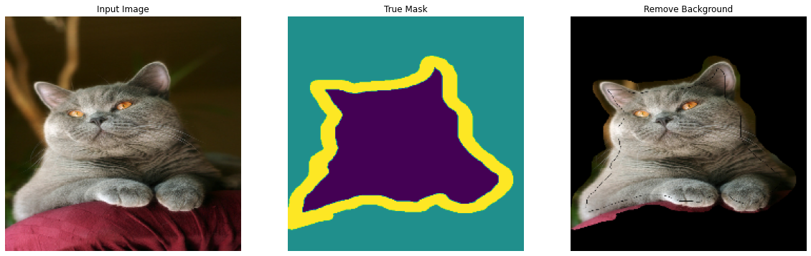

# Image Segmentation with U-Net Model

## I. Download & Manipulate Dataset

### 1. Download dataset


```python
!pip install -q git+https://github.com/tensorflow/examples.git
```

      Building wheel for tensorflow-examples (setup.py) ... [?25l[?25hdone
    


```python
import tensorflow as tf
from tensorflow_examples.models.pix2pix import pix2pix

import tensorflow_datasets as tfds

from IPython.display import clear_output
import matplotlib.pyplot as plt
```


```python
dataset, info = tfds.load('oxford_iiit_pet:3.*.*', with_info=True)
```

    Downloading and preparing dataset oxford_iiit_pet/3.2.0 (download: 773.52 MiB, generated: 774.69 MiB, total: 1.51 GiB) to /root/tensorflow_datasets/oxford_iiit_pet/3.2.0...
    


    HBox(children=(FloatProgress(value=1.0, bar_style='info', description='Dl Completed...', max=1.0, style=Progre…


    HBox(children=(FloatProgress(value=1.0, bar_style='info', description='Dl Size...', max=1.0, style=ProgressSty…


    HBox(children=(FloatProgress(value=1.0, bar_style='info', description='Extraction completed...', max=1.0, styl…


    
    
    
    
    
    
    


    HBox(children=(FloatProgress(value=1.0, bar_style='info', max=1.0), HTML(value='')))


    Shuffling and writing examples to /root/tensorflow_datasets/oxford_iiit_pet/3.2.0.incomplete0VQBDV/oxford_iiit_pet-train.tfrecord
    


    HBox(children=(FloatProgress(value=0.0, max=3680.0), HTML(value='')))


    


    HBox(children=(FloatProgress(value=1.0, bar_style='info', max=1.0), HTML(value='')))


    Shuffling and writing examples to /root/tensorflow_datasets/oxford_iiit_pet/3.2.0.incomplete0VQBDV/oxford_iiit_pet-test.tfrecord
    


    HBox(children=(FloatProgress(value=0.0, max=3669.0), HTML(value='')))


    Dataset oxford_iiit_pet downloaded and prepared to /root/tensorflow_datasets/oxford_iiit_pet/3.2.0. Subsequent calls will reuse this data.
    


```python
IMAGE_SIZE = (224, 224)
INPUT_SHAPE = (224, 224, 3)
```

### 2. Load dataset


```python
@tf.function
def load_image_train(datapoint):
    input_image = tf.image.resize(datapoint['image'], IMAGE_SIZE)
    input_mask = tf.image.resize(datapoint['segmentation_mask'], IMAGE_SIZE)

    if tf.random.uniform(()) > 0.5:
        input_image = tf.image.flip_left_right(input_image)
        input_mask = tf.image.flip_left_right(input_mask)

    input_image, input_mask = normalize(input_image, input_mask)

    return input_image, input_mask

def load_image_test(datapoint):
    input_image = tf.image.resize(datapoint['image'], IMAGE_SIZE)
    input_mask = tf.image.resize(datapoint['segmentation_mask'], IMAGE_SIZE)

    input_image, input_mask = normalize(input_image, input_mask)

    return input_image, input_mask

def normalize(input_image, input_mask):
    input_image = tf.cast(input_image, tf.float32) / 255.0
    input_mask -= 1
    return input_image, input_mask
```

### 3. Separate the train-test dataset


```python
TRAIN_LENGTH = info.splits['train'].num_examples
BATCH_SIZE = 128
BUFFER_SIZE = 1000
STEPS_PER_EPOCH = TRAIN_LENGTH // BATCH_SIZE
```


```python
train = dataset['train'].map(load_image_train, num_parallel_calls=tf.data.AUTOTUNE)
test = dataset['test'].map(load_image_test)

train_dataset = train.cache().shuffle(BUFFER_SIZE).batch(BATCH_SIZE).repeat()
train_dataset = train_dataset.prefetch(buffer_size=tf.data.AUTOTUNE)
test_dataset = test.batch(BATCH_SIZE)
```

## II. Dataset Ultility

### 1. Display the overall images


```python
import numpy as np
def display(display_list, visible_mask = np.array([True, True, True, True])):
    plt.figure(figsize=(20, 20))
    title = ["Input Image", "True Mask", "Predicted Mask", "Remove Background"]
    title = tf.boolean_mask(title, visible_mask).numpy().astype('str')
    for i in range(len(display_list)):
        plt.subplot(1, len(display_list), i+1)
        plt.title(title[i])
        plt.imshow(tf.keras.preprocessing.image.array_to_img(display_list[i]))
        plt.axis('off')
    plt.show()
```

### Mask convert


```python
def convert_mask(t, target = 1.0):
    return tf.math.abs( 
        tf.math.subtract(
            t, 
            tf.convert_to_tensor(target, dtype=tf.float32) 
        ) 
    )

def remove_background(image, mask):
    msk = convert_mask(mask)
    return tf.math.multiply(image, msk)

```

### 3. Some example from train dataset


```python
for image, mask in train.take(5):
    sample_image, sample_mask = image, mask
    result = remove_background(image, mask)
    display([sample_image, sample_mask, result], [True, True, False, True])
```





## III. Construct model

### 1. U-Net model use MobileNetV2 Encode-Decode


```python
from tensorflow.keras.applications import MobileNetV2 as Pretrained_Model
from tensorflow.keras.layers import *

def unet_model_1(output_channels):

    base_model = Pretrained_Model(
        input_shape=INPUT_SHAPE, 
        include_top=False
    )

    # Use the activations of these layers
    layer_names = [
        'block_1_expand_relu',   # 64x64
        'block_3_expand_relu',   # 32x32
        'block_6_expand_relu',   # 16x16
        'block_13_expand_relu',  # 8x8
        'block_16_expand_relu',  # 4x4
    ]

    layers = [base_model.get_layer(name).output for name in layer_names]

    # Create the feature extraction model
    down_stack = tf.keras.Model(inputs=base_model.input, outputs=layers)

    down_stack.trainable = False

    up_stack = [
        pix2pix.upsample(1024, 3),  # 4x4 -> 8x8
        pix2pix.upsample(512, 3),  # 8x8 -> 16x16
        pix2pix.upsample(256, 3),  # 16x16 -> 32x32
        pix2pix.upsample(128, 3),   # 32x32 -> 64x64
    ]

    inputs = Input(shape=INPUT_SHAPE)
    x = inputs

    # Downsampling through the model
    skips = down_stack(x)
    x = skips[-1]
    skips = reversed(skips[:-1])

    # Upsampling and establishing the skip connections
    for up, skip in zip(up_stack, skips):
        x = up(x)
        concat = Concatenate()
        x = concat([x, skip])

    # This is the last layer of the model
    last = Conv2DTranspose(
        output_channels, 3, strides=2,
        padding='same'
    )  #64x64 -> 128x128

    x = last(x)

    return tf.keras.Model(inputs=inputs, outputs=x)
```

### 2. U-Net model use MobileNetV3Large Encode-Decode


```python
from tensorflow.keras.applications import MobileNetV3Large as Pretrained_Model_2
from tensorflow.keras.layers import *

def unet_model_2(output_channels):

    base_model = Pretrained_Model_2(
        input_shape=INPUT_SHAPE, 
        include_top=False
    )

    for index, layer in enumerate(base_model.layers):
        layer._name = 'mylayer_' + str(index)

    # Use the activations of these layers
    layer_names = [
        'mylayer_16',   # 64x64
        'mylayer_28',   # 32x32
        'mylayer_89',   # 16x16
        'mylayer_178',  # 8x8
        'mylayer_273'   # 4x4
    ]

    layers = [base_model.get_layer(name).output for name in layer_names]

    # Create the feature extraction model
    down_stack = tf.keras.Model(inputs=base_model.input, outputs=layers)

    down_stack.trainable = False

    up_stack = [
        pix2pix.upsample(1024, 3),  # 4x4 -> 8x8
        pix2pix.upsample(512, 3),  # 8x8 -> 16x16
        pix2pix.upsample(256, 3),  # 16x16 -> 32x32
        pix2pix.upsample(128, 3),   # 32x32 -> 64x64
    ]

    inputs = Input(shape=INPUT_SHAPE)
    x = inputs

    # Downsampling through the model
    skips = down_stack(x)
    x = skips[-1]
    skips = reversed(skips[:-1])

    # Upsampling and establishing the skip connections
    for up, skip in zip(up_stack, skips):
        x = up(x)
        concat = Concatenate()
        x = concat([x, skip])

    # This is the last layer of the model
    last = Conv2DTranspose(
        output_channels, 3, strides=2,
        padding='same'
    )  #64x64 -> 128x128

    x = last(x)

    return tf.keras.Model(inputs=inputs, outputs=x)
```

### 3. Self-made Unet


```python
from tensorflow.keras.layers import *

def bottleneck(x, filters, kernel_size=(3, 3), padding="same", strides=1, numberOfLayer = 2):
    input_layer = x
    for i in range(numberOfLayer):
        input_layer = Conv2D(filters, kernel_size, padding=padding, strides=strides, activation="relu")(input_layer)
    return input_layer

def down_block(x, filters, kernel_size=(3, 3), padding="same", strides=1, numberOfLayer = 2):
    c = bottleneck(x, filters, kernel_size, padding, strides, numberOfLayer)
    p = MaxPool2D((2, 2), (2, 2))(c)
    return c, p

def up_block(x, skip, filters, kernel_size=(3, 3), padding="same", strides=1, numberOfLayer = 2):
    us = UpSampling2D((2, 2))(x)
    concat = Concatenate()([us, skip])
    c = bottleneck(concat, filters, kernel_size, padding, strides, numberOfLayer)
    return c
```


```python
def unet_model_3(channels):
    f = [32, 64, 128, 256, 512, 1024]
    numOfLayer = 4
    inputs = Input(INPUT_SHAPE)
    
    conv = []
    pool = inputs
    for i in range(len(f) - 1):
        c, pool = down_block(pool, f[1], numberOfLayer=numOfLayer)
        conv.append(c)

    # c1, p1 = down_block(p0, f[0]) #128 -> 64
    # c2, p2 = down_block(p1, f[1]) #64 -> 32
    # c3, p3 = down_block(p2, f[2]) #32 -> 16
    # c4, p4 = down_block(p3, f[3]) #16->8
    
    bn = bottleneck(pool, f[-1])
    up = bn
    
    for i in range(len(f) - 2, 0, -1):
        up = up_block(up, conv.pop(), f[i], numberOfLayer=numOfLayer)

    # u1 = up_block(bn, c4, f[3]) #8 -> 16
    # u2 = up_block(u1, c3, f[2]) #16 -> 32
    # u3 = up_block(u2, c2, f[1]) #32 -> 64
    # u4 = up_block(u3, c1, f[0]) #64 -> 128

    # outputs = Conv2D(1, (1, 1), padding="same", activation="sigmoid")(up)
    outputs = Conv2DTranspose(channels, 3, strides=2, padding='same', activation='softmax')(up)

    model = tf.keras.models.Model(inputs, outputs)
    return model
```

## IV. Let's get started

### 0. Model Ultility


```python
class ModelManager(object):

    def __init__(self):
        self._ModelRegistry_ = {}

    def is_key_exist(self, key):
        return key in self._ModelRegistry_.keys()

    def is_model_exist(self, model):
        return model in self._ModelRegistry_.values()

    def register_model(self, key, model):
        if self.is_key_exist(key):
            if self.__ModelRegistry_[key] == model:
                return model
            print("Key exist in registry and registered for another model!")
            return model

        if self.is_model_exist(model):
            if self._ModelRegistry_.index(model) == key:
                return model
            print('Model is already registred with index : ' + str(self._ModelRegistry_.index(model)))
            return model

        print('Register done!')
        self._ModelRegistry_[key] = model
        return model

    def get_model(self, key):
        return self._ModelRegistry_[key]
```

### 1. Register all models


```python
manager = ModelManager()

manager.register_model('unet_mobilenetv2', unet_model_1(3)),
manager.register_model('unet_mobilenetv3', unet_model_2(3)),
manager.register_model('unet_diy', unet_model_3(3))
```

    Downloading data from https://storage.googleapis.com/tensorflow/keras-applications/mobilenet_v2/mobilenet_v2_weights_tf_dim_ordering_tf_kernels_1.0_224_no_top.h5
    9412608/9406464 [==============================] - 0s 0us/step
    Register done!
    Downloading data from https://storage.googleapis.com/tensorflow/keras-applications/mobilenet_v3/weights_mobilenet_v3_large_224_1.0_float_no_top.h5
    17612800/17605208 [==============================] - 0s 0us/step
    Register done!
    Register done!
    


    <tensorflow.python.keras.engine.functional.Functional at 0x7f1a586545f8>


### 2. Brief information of Model 


```python
#@title Select a model to try { run: "auto", vertical-output: true, display-mode: "form" }
model_name = "unet_mobilenetv3" #@param ["unet_mobilenetv2", "unet_mobilenetv3", "unet_diy"] {allow-input: true}
print(model_name + " is choose!")
```

    unet_mobilenetv3 is choose!
    


```python
model = manager.get_model(model_name)
```


```python
model.summary()
```

    Model: "model_3"
    __________________________________________________________________________________________________
    Layer (type)                    Output Shape         Param #     Connected to                     
    ==================================================================================================
    input_4 (InputLayer)            [(None, 224, 224, 3) 0                                            
    __________________________________________________________________________________________________
    model_2 (Functional)            [(None, 112, 112, 64 4226432     input_4[0][0]                    
    __________________________________________________________________________________________________
    sequential_4 (Sequential)       (None, 14, 14, 1024) 11800576    model_2[0][4]                    
    __________________________________________________________________________________________________
    concatenate_4 (Concatenate)     (None, 14, 14, 1696) 0           sequential_4[0][0]               
                                                                     model_2[0][3]                    
    __________________________________________________________________________________________________
    sequential_5 (Sequential)       (None, 28, 28, 512)  7817216     concatenate_4[0][0]              
    __________________________________________________________________________________________________
    concatenate_5 (Concatenate)     (None, 28, 28, 752)  0           sequential_5[0][0]               
                                                                     model_2[0][2]                    
    __________________________________________________________________________________________________
    sequential_6 (Sequential)       (None, 56, 56, 256)  1733632     concatenate_5[0][0]              
    __________________________________________________________________________________________________
    concatenate_6 (Concatenate)     (None, 56, 56, 328)  0           sequential_6[0][0]               
                                                                     model_2[0][1]                    
    __________________________________________________________________________________________________
    sequential_7 (Sequential)       (None, 112, 112, 128 378368      concatenate_6[0][0]              
    __________________________________________________________________________________________________
    concatenate_7 (Concatenate)     (None, 112, 112, 192 0           sequential_7[0][0]               
                                                                     model_2[0][0]                    
    __________________________________________________________________________________________________
    conv2d_transpose_9 (Conv2DTrans (None, 224, 224, 3)  5187        concatenate_7[0][0]              
    ==================================================================================================
    Total params: 25,961,411
    Trainable params: 21,731,139
    Non-trainable params: 4,230,272
    __________________________________________________________________________________________________
    


```python
tf.keras.utils.plot_model(model, show_shapes=True)
```


### 3. Training Model


```python
OUTPUT_CHANNELS = 3
EPOCHS = 50
VAL_SUBSPLITS = 5
VALIDATION_STEPS = info.splits['test'].num_examples//BATCH_SIZE//VAL_SUBSPLITS

optimizer = tf.keras.optimizers.Adam(
    learning_rate = tf.keras.optimizers.schedules.ExponentialDecay(
        initial_learning_rate = 0.01,
        decay_steps=10000,
        decay_rate=0.95,
        staircase=True
    )
)

loss=tf.keras.losses.SparseCategoricalCrossentropy(from_logits=True)

metrics = ['accuracy']
```


```python
model.compile(
    optimizer = optimizer,
    loss = loss,
    metrics = metrics
)

history = model.fit(
    train_dataset, epochs=EPOCHS,
    steps_per_epoch=STEPS_PER_EPOCH,
    validation_steps=VALIDATION_STEPS,
    validation_data=test_dataset,
    callbacks=[
        tf.keras.callbacks.EarlyStopping(monitor='loss', patience=5),
        tf.keras.callbacks.EarlyStopping(monitor='val_loss', patience=5)
    ]
)
```

    Epoch 1/50
    28/28 [==============================] - 63s 2s/step - loss: 3.0286 - accuracy: 0.4597 - val_loss: 2.0187 - val_accuracy: 0.3537
    Epoch 2/50
    28/28 [==============================] - 48s 2s/step - loss: 1.0852 - accuracy: 0.5193 - val_loss: 0.9802 - val_accuracy: 0.5178
    Epoch 3/50
    28/28 [==============================] - 45s 2s/step - loss: 0.8986 - accuracy: 0.5861 - val_loss: 0.9585 - val_accuracy: 0.4705
    Epoch 4/50
    28/28 [==============================] - 46s 2s/step - loss: 0.8137 - accuracy: 0.6326 - val_loss: 1.5124 - val_accuracy: 0.4686
    Epoch 5/50
    28/28 [==============================] - 46s 2s/step - loss: 0.7515 - accuracy: 0.6864 - val_loss: 0.9496 - val_accuracy: 0.5947
    Epoch 6/50
    28/28 [==============================] - 47s 2s/step - loss: 0.7487 - accuracy: 0.6887 - val_loss: 0.8495 - val_accuracy: 0.6332
    Epoch 7/50
    28/28 [==============================] - 47s 2s/step - loss: 0.7539 - accuracy: 0.6864 - val_loss: 0.7806 - val_accuracy: 0.6716
    Epoch 8/50
    28/28 [==============================] - 48s 2s/step - loss: 0.7403 - accuracy: 0.6927 - val_loss: 0.7855 - val_accuracy: 0.6723
    Epoch 9/50
    28/28 [==============================] - 48s 2s/step - loss: 0.7326 - accuracy: 0.6966 - val_loss: 0.8247 - val_accuracy: 0.6455
    Epoch 10/50
    28/28 [==============================] - 48s 2s/step - loss: 0.7419 - accuracy: 0.6928 - val_loss: 0.7667 - val_accuracy: 0.6788
    Epoch 11/50
    28/28 [==============================] - 48s 2s/step - loss: 0.7532 - accuracy: 0.6865 - val_loss: 0.7715 - val_accuracy: 0.6770
    Epoch 12/50
    28/28 [==============================] - 48s 2s/step - loss: 0.7390 - accuracy: 0.6941 - val_loss: 0.7534 - val_accuracy: 0.6873
    Epoch 13/50
    28/28 [==============================] - 48s 2s/step - loss: 0.7374 - accuracy: 0.6927 - val_loss: 0.7702 - val_accuracy: 0.6770
    Epoch 14/50
    28/28 [==============================] - 48s 2s/step - loss: 0.7308 - accuracy: 0.6966 - val_loss: 0.7758 - val_accuracy: 0.6729
    Epoch 15/50
    28/28 [==============================] - 48s 2s/step - loss: 0.7424 - accuracy: 0.6922 - val_loss: 0.8108 - val_accuracy: 0.6550
    Epoch 16/50
    28/28 [==============================] - 48s 2s/step - loss: 0.7503 - accuracy: 0.6880 - val_loss: 0.7726 - val_accuracy: 0.6746
    Epoch 17/50
    28/28 [==============================] - 48s 2s/step - loss: 0.7337 - accuracy: 0.6935 - val_loss: 0.7807 - val_accuracy: 0.6749
    

### 4. Model Evaluation


```python
loss = history.history['loss']
val_loss = history.history['val_loss']

epochs = range(len(loss))

plt.figure()
plt.plot(epochs, loss, 'r', label='Training loss')
plt.plot(epochs, val_loss, 'b', label='Validation loss')
plt.title('Training and Validation Loss')
plt.xlabel('Epoch')
plt.ylabel('Loss Value')
plt.ylim([0, max(loss)])
plt.legend()
plt.show()

acc = history.history['accuracy']
val_acc = history.history['val_accuracy']

plt.figure()
plt.plot(epochs, acc, 'r', label='Training accuracy')
plt.plot(epochs, val_acc, 'b', label='Validation accuracy')
plt.title('Training and Validation Accuracy')
plt.xlabel('Epoch')
plt.ylabel('Accuracy')
plt.ylim([0, 1])
plt.legend()
plt.show()
```


```python
model.evaluate(
    test_dataset, 
    batch_size=STEPS_PER_EPOCH
)
```

    29/29 [==============================] - 23s 792ms/step - loss: 0.7776 - accuracy: 0.6764
    


    [0.7776436805725098, 0.6764015555381775]


## V. Application in real example


```python
def create_mask(pred_mask):
    pred_mask = tf.argmax(pred_mask, axis=-1)
    pred_mask = pred_mask[..., tf.newaxis]
    return pred_mask[0]
```


```python
def show_predictions(model, dataset=None, num=1):
   
    if dataset:
        for image, mask in dataset.take(num):
            pred_mask = create_mask(model.predict(image))
            result = remove_background(
                image[0],
                tf.cast(pred_mask, tf.float32)
            )
            display([image[0], mask[0], pred_mask, result])
    else:
        pred_mask =  create_mask(model.predict(sample_image[tf.newaxis, ...]))
        # result = remove_background(sample_image, pred_mask)
        display([sample_image, sample_mask, pred_mask])
```

### 1. From test dataset


```python
show_predictions(model, test_dataset, 10)
```


### 2. Let try your example 


```python
import matplotlib.pyplot as plt
import cv2 as cv
from google.colab import files
uploaded = files.upload()

for name, data in uploaded.items():
  with open(name, 'wb') as f:
    f.write(data)
    print ('saved file', name)

img = cv.imread(name)
img_cvt=cv.cvtColor(img, cv.COLOR_BGR2RGB)
plt.imshow(img_cvt)
plt.show()
```


<input type="file" id="files-789184c8-7bd8-400b-b44c-180172295f88" name="files[]" multiple disabled
   style="border:none" />
<output id="result-789184c8-7bd8-400b-b44c-180172295f88">
 Upload widget is only available when the cell has been executed in the
 current browser session. Please rerun this cell to enable.
 </output>
 <script src="/nbextensions/google.colab/files.js"></script> 


    Saving download.jpg to download.jpg
    saved file download.jpg
    


```python
resize_img = cv.resize(img, IMAGE_SIZE)

reshape_img = np.reshape(resize_img , (1, resize_img.shape[0], resize_img.shape[1], resize_img.shape[2]))

pred_mask = create_mask(model.predict(reshape_img))

result = remove_background(
    resize_img,
    tf.cast(pred_mask, tf.float32)
)

display([cv.cvtColor(resize_img, cv.COLOR_BGR2RGB), pred_mask, result], [True, False, True, True])
```


